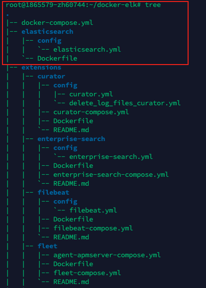
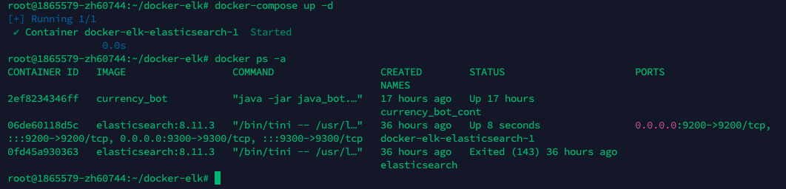
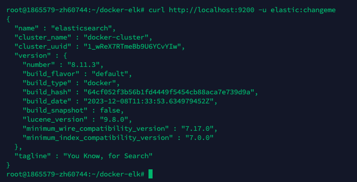

### Разворачивание Elasticsearch


1. Скачать образ ES с docker-hub.com. При необходимости развернуть весь ELK-стек или добавить иные расширения, установить их образы.

```
docker pull elasticsearch:[version]
```


2.  Создать структуру 



Можно воспользоваться решением репозитория - https://github.com/deviantony/docker-elk
Но с изменением файлов elasticsearch.yml и соответствующих .yml файлов других расширений,
поскольку в них прописывается загрузка официальных образов. 
Образы с официальных сайтов Elasticsearch и других из РФ на сегодняшний день подтянуть невозможно 

3. Для запуска Elasticsearch используются:

`elasticsearch/config/elasticsearch.yml` - базовая конфигурация ES (имя кластера, network.hosts - 
настройка адресов, с котрых можно подключаться к  ES, настройки X-Pack лицензии, безопасности и мониторинга)

См. [elasticsearch.yml](elasticsearch.yml)

`Dockerfile` - загрузка файла c https://www.docker.elastic.co/ (не будет использован в случае РФ, в docker-compose файле будет использован image-образ, установленный с docker-hub)

`docker-compose.yml` - основной конфиг-файл для оркестрации контейнеров
В данном случае отвечает за настройку службы Elasticsearch, другие службы прописываются здесь же, в `services`

См. [docker-compose.yml](docker-compose.yml)

4. Запустить Docker Compose

```
docker-compose up -d
```
Проверка запуска



5. Тестовый запрос к Elasticsearch

